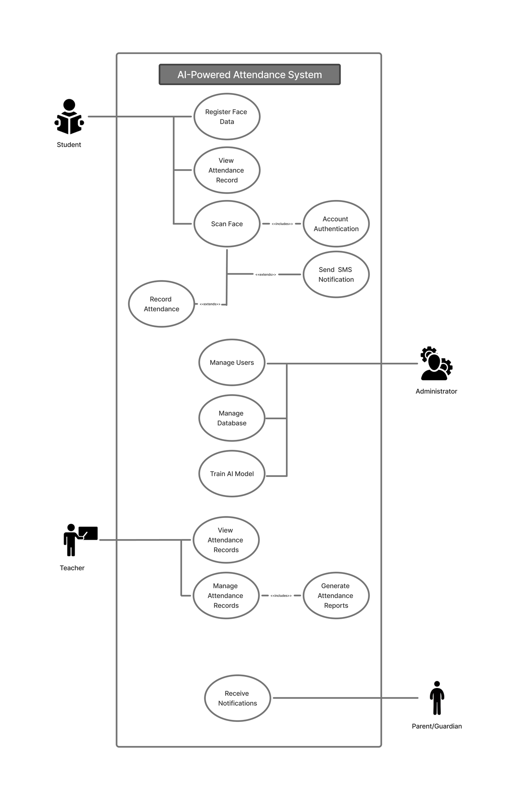

# SE-AI-Powered-Attendance-System
The AI-Powered Attendance Monitoring System uses facial recognition technology to simplify and improve the way attendance is tracked in schools. Students scan their face using a tablet, and instead of saving the actual face image, the system converts it into a face embedding. Making the data privacy-friendly and secure.

## Data Privacy and Security Measures
### Compliance & Legal Framework
- Philippine Data Privacy Act of 2012 (RA 10173)- Full compliance with national data protection regulation.
- Educational Purpose- System designed strictly for academic/prototype demonstration
- Informed Consent Required - All participants must provide written consent before facial data capture

### Security Implementation
- Encrypted Storage - All facial recognition data encrypted using industry-standard algorithms
- Access Control - Password-protected system with role-based authorization (Admin, Teacher, Student)
- Local Data Storage - Prototype operates on local server/device; no cloud transmission during testing phase
- Secure Database - MySQL with authentication, prepared statements to prevent SQL injection
- Session Management - Secure login sessions with automatic timeout mechanisms

## Key Features
- Face registration using a tablet.
- Privacy-Protected Face Embeddings (no raw images stored).
- AI-powered face recognition for attendance.
- Teachers can manage and monitor attendance in real time.
- Students can view their attendance records.
- admin can generate class and student reports
- Central database with secure access per role

## Backend Overview

The backend is built using **Node.js** and **Express.js**, located in `src/Backend/`. It handles all API endpoints for face registration, attendance logging, student management, and future dashboard integration.

### Structure:
- `controllers/` — Contains logic for handling attendance, recognition, and student data.
- `routes/` — Defines API endpoints for face recognition, attendance, and student registration.
- `server.js` — Initializes the Express server and middleware.
- `data/` — Placeholder for future database integration or JSON-based logging.

### Key Endpoints:
- `POST /students` — Register a new student.
- `POST /recognize` — Submit face embedding for recognition.
- `POST /attendance` — Log attendance manually or via recognition.
- `GET /attendance` — Retrieve attendance records.

> The backend is modular and ready for integration with a Figma-ready frontend dashboard.

## UML Diagrams

### 1. Use Case Diagram
The Use Case Diagram shows how the AI-Powered Attendance System works with four main users — Student, Teacher, Administrator, and Parent/Guardian. Students register and scan their faces for attendance, teachers manage records and reports, administrators handle users and the AI model, while parents receive notifications.



### 2. Class Diagram
This class diagram represents the structure of our AI-Powered Attendance System.
It shows the main classes such as Student, Teacher, Administrator, Parent/Guardian, AttendanceRecord, AIRecognitionSystem, NotificationSystem, and Database — and their relationships. The diagram highlights how data flows between components for recording attendance, sending notifications, and generating reports. It serves as a guide for system development and integration of all features.

![SE-AI-Powered-Attendance-System/UML/\[SOFT ENG\] CLASS DIAGRAM.jpg](<UML/Updated Class Diagram.png>)


### 3. Use Case Description
The Use Case Description explains how each actor (Student, Administrator, Teacher, and Parent/Guardian) interacts with the system. It defines the system’s main functions such as face registration, attendance scanning, report generation, and notification handling. These descriptions provide a detailed view of the system’s behavior in different user scenarios.

[SE-AI-Powered-Attendance-System\UML\UML Use Case Description_ Attendance System.pdf](<UML/UML Use Case Description_ Attendance System.pdf>)

## 4. System Architectural
The **AI-Powered Attendance System** follows a **Client–Server Layered Architecture** that separates the system into three main layers: the **Presentation Layer**, **Application Layer**, and **Data Layer**.  
This design ensures **functional independence**, making the system more scalable, maintainable, and secure.

### Layers Description
1. **Presentation Layer**
   - This is the tablet interface used by students and teachers.
   - Handles user interactions such as facial registration, attendance scanning, and report viewing.

2. **Application Layer**
   - Contains the **AI recognition module**, **attendance logic**, and business rules**.
   - Processes input from the presentation layer and communicates with the database.
  
3. **Data Layer**
   - Responsible for storing and managing data in the **MySQL Database**.
   - Uses encryptioin and authentication to ensure secure data access and storage.
  
## Architectural Flow
The system's overall data flow and interaction between components can be illustrated as follows:
```
[Tablet Interface (Student/Teacher)]
↓
[AI Recognition Module / Application Logic]
↓
[Server / API Communication Layer]
↓
[Database (MySQL)]
↑
[Admin Dashboard / Reports]
→
[Parent/Guardian Notification (SMS)]
```

## Procedural Design

This procedural design flowchart illustrates the complete user flow of the AI-Powered Attendance Monitoring System, detailing how students, teachers, and administrators interact with the platform.
It includes account creation, login validation, password recovery, dashboard navigation, AI attendance processing, and system administration features.


### 1. System Entry

The system begins when the user opens the Attendance System program.

The user is prompted to select their account type:

Student

Teacher

Admin

### 2. Account Authentication
Login Process

Each user type enters their username and password.

The system verifies login credentials.

Invalid Credentials

If the credentials are incorrect:

The system displays: “Invalid username or password. Forgot Password?”

User may proceed to the Forgot Password workflow:

Enter email to receive reset link

System sends reset link

User enters a new password

Password reset success → Returns to Login

Valid Credentials

Users proceed to their respective dashboards.

### 3. Teacher Workflow
Teacher Dashboard Options

View Students' Attendance Records

Manage Attendance Records

Mark students Present, Late, or Absent

View Notifications

Sign Out → End

### 4. Student Workflow
Student Dashboard Options

Scan Face for attendance

If face is detected, the AI verifies identity

If recognized → Marks attendance and updates database

If not recognized → System logs as unknown / retry prompt

If face not detected → System prompts for repositioning

View Personal Notifications

View Class Schedule

Sign Out → End

### 5. Admin Workflow
Admin Dashboard Features

Manage Users

Add, Edit, or Delete Accounts

Train AI Model

Update datasets for facial recognition

Manage Notifications / SMS Logs

Backup and Restore Database

Sign Out → End

### 6. System Exit

All user types terminate their workflow by selecting Sign Out, leading to the End of the procedural flow.

**Flow Explanation:**
1. Students scan their faces using the tablet interface.  
2. The AI module processes the image, generates a **face embedding**, and checks it against the database.  
3. If recognized, attendance is automatically marked in the database.  
4. Teachers and administrators can access attendance data via the dashboard or reports.  
5. The system ensures that all data is handled securely and locally during testing.
6. Parent/Guardian will receive SMS updates when attendance is recorded or if a student is marked absent.

> "In future versions, a **Parent Dashboard** may be added for detailed attendance tracking and analytics."


## Team and Contributions

| **Member** | **Role** | **Contributions** |
|-------------|-----------|-------------------|
| **Owen Robert Magsayo** | Team Leader | - Created and updated the **README.md** and full project **documentation**.<br>- Designed both the **Use Case Diagram** and **Class Diagram**.<br>- Consolidated and organized all files for submission.<br>- Created the **Procedural Design**. |
| **Annie Rose Mamitag**  | Team Member    | - Created the GitHub repository.<br>- Designed diagrams and architectural flow.<br>- Added Key Features section.<br>- Created UI interface and backend folder structure.<br>**- Developed and modularized the backend using Express.js.**<br>**- Validated API endpoints and prepared for frontend integration.** |
| **Norwejean Arnado** | Team Member | - Collaborated on both the **Use Case Diagram** and **Class Diagram**.<br>- Wrote the **Data Privacy and Security Measures**, **Compliance & Legal Framework**, and **Security Implementation** sections.<br>- Modified and refined the final **Class Diagram** design.<br>- Created the **Data Design** and database. |
